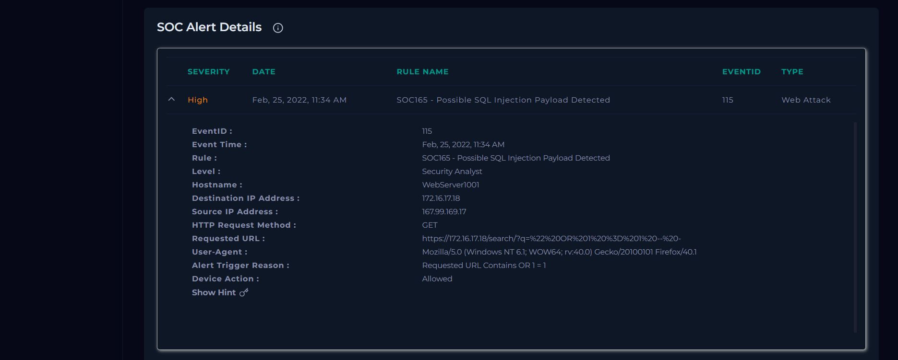
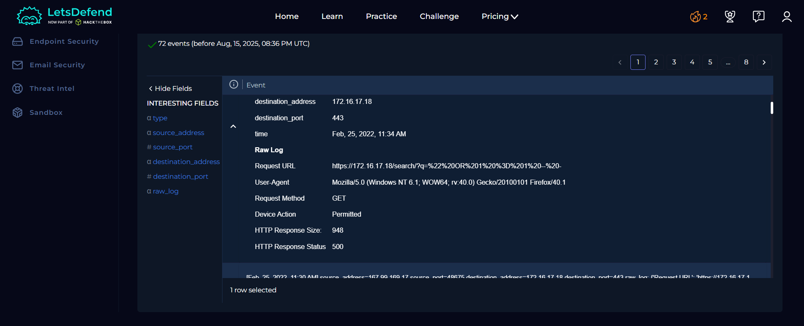
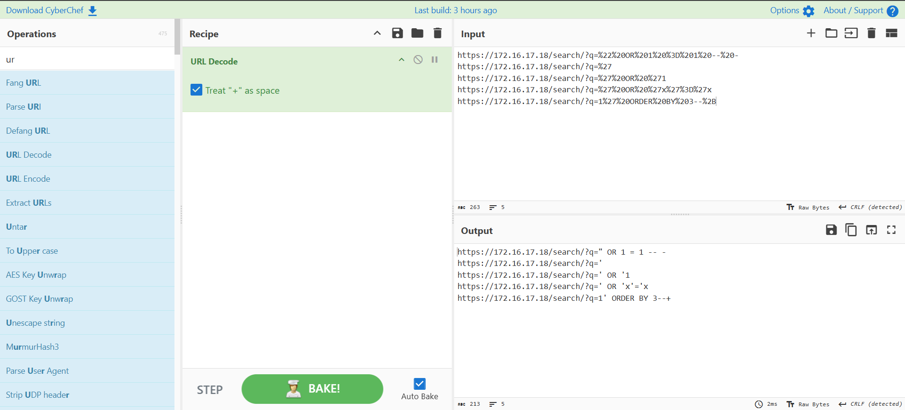
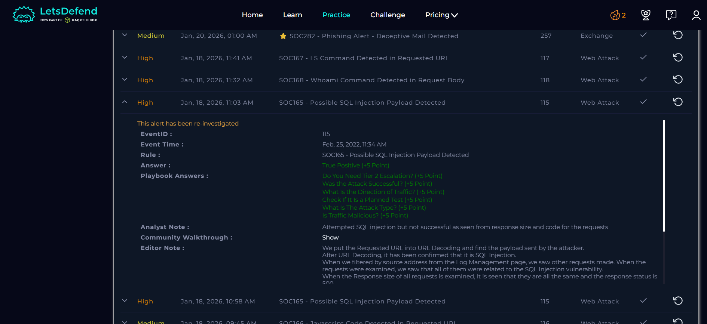

# SOC Alert Investigation Report

**Platform:** LetsDefend 
**Alert Name:** SOC165 - Possible SQL Injection Payload Detected 
**Analyst Level:** Security Analyst 
**Status:** True Positive

------------------------------------------------------------------------

## Alert Overview

Below is the original alert generated in LetsDefend:



## Alert Details

| Field | Value |
|-------|--------|
| **Event ID** | 115 |
| **Event Time** | Feb 25, 2022 -- 11:34 AM |
| **Rule Name** | SOC165 - Possible SQL Injection Payload Detected |
| **Hostname** | WebServer1001 |
| **Source IP Address** | 167.99.169.17 |
| **Destination IP Address** | 172.16.17.18 |
| **HTTP Method** | GET |
| **Requested URL** | https://172.16.17.18/search/?q=%22%20OR%201%20%3D%201%20--%20- |
| **User-Agent** | Mozilla/5.0 (Windows NT 6.1; WOW64; rv:40.0) Firefox/40.1 |
| **Alert Trigger Reason** | Requested URL contains OR 1 = 1 |
| **Device Action** | Allowed |

------------------------------------------------------------------------

# Investigation Process (Playbook)

## 1️⃣ Tier Escalation Check

**Do you need Tier 2 escalation?**  
No  

------------------------------------------------------------------------

## 2️⃣ Attack Success Evaluation



**Was the attack successful?**  
No  

### Analysis

- HTTP **500 error responses** observed  
- Response sizes remained consistent across multiple attempts  
- No indication of data leakage or successful query manipulation  

**Selection:** Not Successful  

------------------------------------------------------------------------

## 3️⃣ Traffic Direction Analysis

**What is the direction of traffic?**  
Internet → Company Network  

### Analysis

- Source IP: External (167.99.169.17)  
- Destination IP: Internal (172.16.17.18)  

------------------------------------------------------------------------

## 4️⃣ Planned Test Verification

**Is this a planned test?**  
Not Planned  

### Analysis

- Reviewed internal communications/logs  
- No evidence of authorized security testing  

------------------------------------------------------------------------

## 5️⃣ Attack Type Identification



**What is the attack type?**  
SQL Injection  

### Analysis

Multiple payloads were observed targeting the web application. After decoding and reviewing the requests, the following patterns were identified:

```
https://172.16.17.18/search/?q=" OR 1 = 1 -- -
https://172.16.17.18/search/?q='
https://172.16.17.18/search/?q=' OR '1
https://172.16.17.18/search/?q=' OR 'x'='x
https://172.16.17.18/search/?q=1' ORDER BY 3--+
```

These payloads indicate classic SQL injection techniques:

- `" OR 1 = 1 --` → Attempts to bypass authentication by making condition always true  
- `' OR 'x'='x` → Another always-true condition  
- `'` → Used to test for SQL syntax errors (injection point detection)  
- `ORDER BY` → Used to enumerate database structure (column count discovery)  

These patterns confirm an attempt to manipulate backend SQL queries.

------------------------------------------------------------------------

## 6️⃣ Malicious Traffic Determination

**Is traffic malicious?**  
Malicious  

------------------------------------------------------------------------

# Artifacts Collected

| Value | Type |
|------|------|
| `https://172.16.17.18/search/?q=%22%20OR%201%20%3D%201%20--%20-` | Malicious URL |
| `https://172.16.17.18/search/?q=%27` | Malicious URL |
| `https://172.16.17.18/search/?q=%27%20OR%20%271` | Malicious URL |
| `https://172.16.17.18/search/?q=%27%20OR%20%27x%27%3D%27x` | Malicious URL |
| `https://172.16.17.18/search/?q=1%27%20ORDER%20BY%203--%2B` | Malicious URL |

------------------------------------------------------------------------

#  Analyst Note

The alert was triggered due to multiple SQL injection attempts targeting the web application. The payloads included common SQL injection patterns such as `" OR 1 = 1 --` and variations designed to manipulate database queries.

Despite multiple attempts, the attack was unsuccessful. This conclusion is based on consistent HTTP response sizes and the presence of HTTP 500 error codes, indicating that the server did not return any meaningful data or allow query manipulation.

------------------------------------------------------------------------

# Final Verdict

**Classification:** True Positive**Impact:** Attempted Attack (Failed)**Compromise Status:** No compromise**Action Taken:** Alert closed after verification



---

## License

This project is licensed under the MIT License. See the [LICENSE](LICENSE) file for details.

---

## ⚠️ Disclaimer

This project is based on a simulated SOC environment provided by LetsDefend.

All scenarios, logs, IP addresses, hostnames, and artifacts are part of a training platform and may or may not represent real organizational infrastructure.

This report is created solely for educational and portfolio purposes.

Screenshots are taken from the LetsDefend training platform and are used here for educational documentation purposes only.
