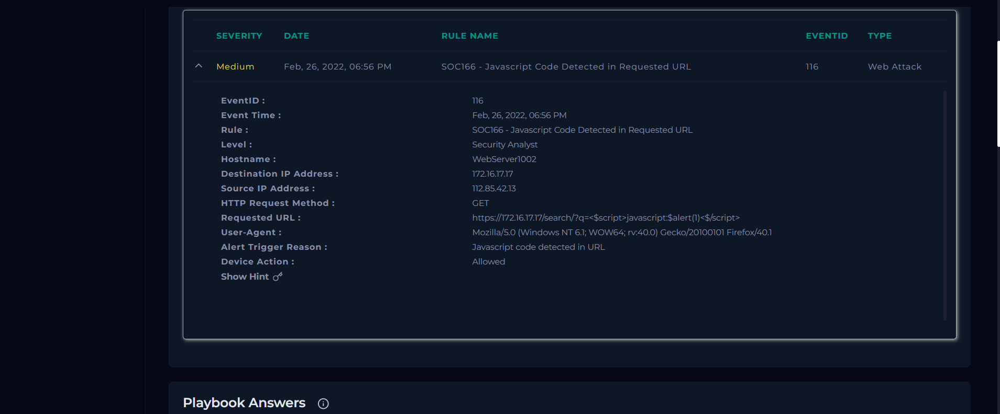
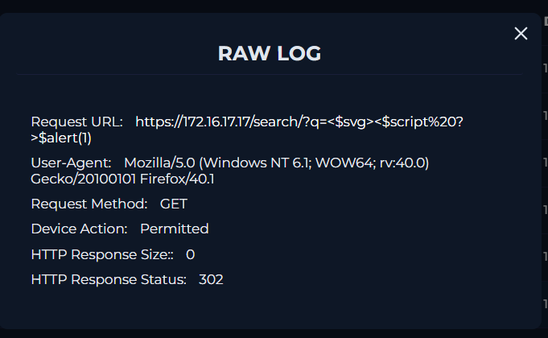
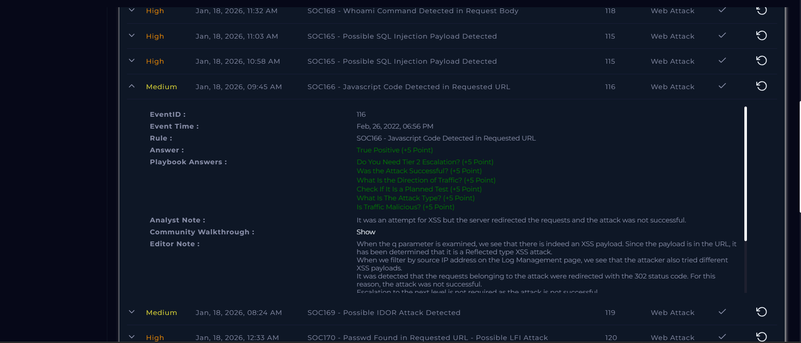

# SOC Alert Investigation Report

**Platform:** LetsDefend\
**Alert Name:** SOC166 - Javascript Code Detected in Requested URL\
**Analyst Level:** Security Analyst\
**Status:** True Positive

------------------------------------------------------------------------

## Alert Overview

Below is the original alert generated in LetsDefend:



##  Alert Details

| Field | Value |
|-------|--------|
| **Event ID** | 116 |
| **Event Time** | Feb 26, 2022 -- 06:56 PM |
| **Rule Name** | SOC166 - Javascript Code Detected in Requested URL |
| **Hostname** | WebServer1002 |
| **Source IP Address** | 112.85.42.13 |
| **Destination IP Address** | 172.16.17.17 |
| **HTTP Method** | GET |
| **Requested URL** | https://172[.]16[.]17[.]17/search/?q=<$script>javascript:$alert(1)<$/script> |
| **User-Agent** | Mozilla/5.0 (Windows NT 6.1; WOW64; rv:40.0) Firefox/40.1 |
| **Alert Trigger Reason** | Javascript code detected in URL |
| **Device Action** | Allowed |

------------------------------------------------------------------------

# Investigation Process (Playbook)

## 1️⃣ Tier Escalation Check

**Do you need Tier 2 escalation?**  
No  

------------------------------------------------------------------------

## 2️⃣ Attack Success Evaluation



**Was the attack successful?**  
No  

### Analysis

- Server response size was **0 bytes**  
- The server redirected the request instead of executing the JavaScript  
- No malicious code was executed  

**Selection:** Not Successful  

------------------------------------------------------------------------

## 3️⃣ Traffic Direction Analysis

**What is the direction of traffic?**  
Internet → Company Network  

### Analysis

- Source IP: External (112.85.42.13)  
- Destination IP: Internal (172.16.17.17)  

------------------------------------------------------------------------

## 4️⃣ Planned Test Verification

**Is this a planned test?**  
Not Planned  

### Analysis

- Checked internal communications/logs  
- No evidence of authorized testing  

------------------------------------------------------------------------

## 5️⃣ Attack Type Identification

**What is the attack type?**  
XSS (Cross-Site Scripting)  

### Analysis

- Malicious JavaScript code embedded in the URL:
```text
https://172[.]16[.]17[.]17/search/?q=<$script>javascript:$alert(1)<$/script>
```
- Attempted **XSS injection** via URL parameter  
- Server properly handled input and **redirected request**, preventing execution  

------------------------------------------------------------------------

## 6️⃣ Malicious Traffic Determination

**Is traffic malicious?**  
Malicious  

------------------------------------------------------------------------

#  Artifacts Collected

| Value | Comment | Type |
|-------|--------|------|
| `https://172[.]16[.]17[.]17/search/?q=<$script>javascript:$alert(1)<$/script>` | Malicious URL | E-mail Domain |

------------------------------------------------------------------------

#  Analyst Note

The alert was triggered due to an XSS attempt in the requested URL. The server did not execute the JavaScript but redirected the request, preventing any malicious execution. The attack was not successful, but the URL was malicious and has been added to the artifacts for threat intelligence.

------------------------------------------------------------------------

# Final Verdict

**Classification:** True Positive\
**Impact:** Attempted XSS (Failed)\
**Compromise Status:** No compromise\
**Action Taken:** Alert closed after verification



---

## License

This project is licensed under the MIT License. See the [LICENSE](LICENSE) file for details.

---

## ⚠️ Disclaimer

This project is based on a simulated SOC environment provided by LetsDefend.

All scenarios, logs, IP addresses, hostnames, and artifacts are part of a training platform and may or may not represent real organizational infrastructure.

This report is created solely for educational and portfolio purposes.

Screenshots are taken from the LetsDefend training platform and are used here for educational documentation purposes only.
