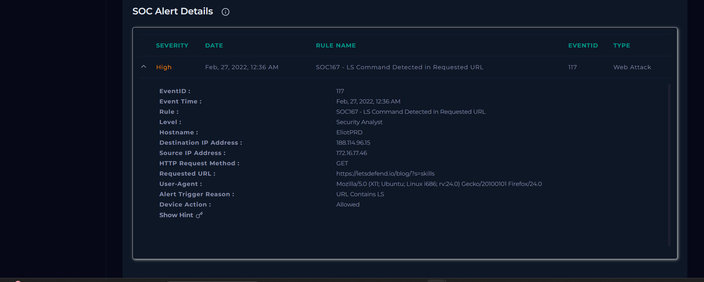
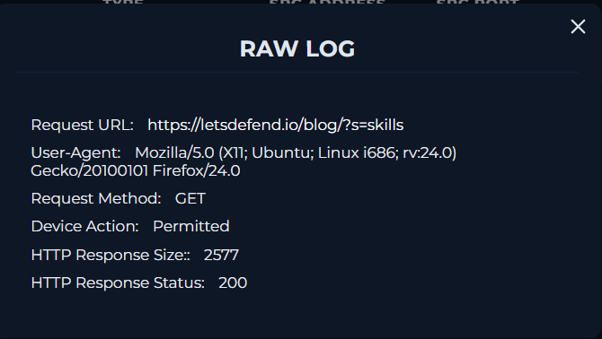
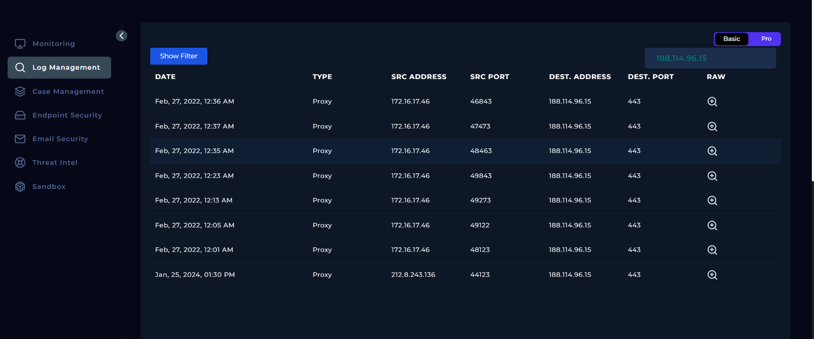
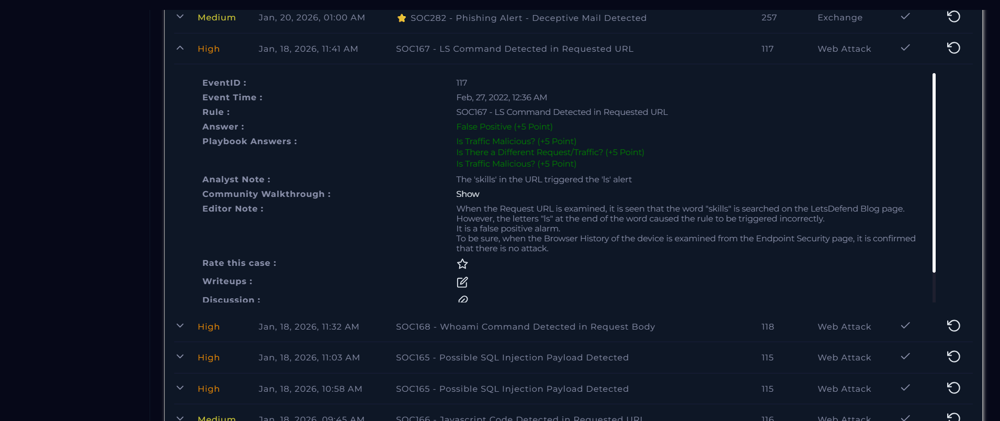

# SOC Alert Investigation Report

**Platform:** LetsDefend\
**Alert Name:** SOC167 - LS Command Detected in Requested URL\
**Analyst Level:** Security Analyst\
**Status:** False Positive

------------------------------------------------------------------------

## Alert Overview

Below is the original alert generated in LetsDefend:

## Alert Details

| Field | Value |
|-------|--------|
| **Event ID** | 117 |
| **Event Time** | Feb 27, 2022 -- 12:36 AM |
| **Rule Name** | SOC167 - LS Command Detected in Requested URL |
| **Hostname** | EliotPRD |
| **Source IP Address** | 172.16.17.46 |
| **Destination IP Address** | 188.114.96.15 |
| **HTTP Method** | GET |
| **Requested URL** | https://letsdefend[.]io/blog/?s=skills |
| **User-Agent** | Mozilla/5.0 (X11; Ubuntu; Linux i686; rv:24.0) Gecko/20100101 Firefox/24.0 |
| **Alert Trigger Reason** | URL contains LS |
| **Device Action** | Allowed |

------------------------------------------------------------------------

# Investigation Process (Playbook)

## 1️⃣ Malicious Traffic Verification

**Is traffic malicious?**  
Non-malicious  

### Analysis

- The URL requested included `skills` which contains the string `ls`  
- Server logs confirm traffic was typical search activity  
- No suspicious or harmful behavior detected  

------------------------------------------------------------------------

## 2️⃣ Different Requests / Traffic Review

**Is there different request/traffic?**  
Yes  

### Analysis

- Reviewed all traffic related to the source IP  
- Traffic included searches about SOC analyst skills, resume, red team/blue team topics, and career information  

------------------------------------------------------------------------

## 3️⃣ Analyst Note

The alert was triggered by the substring `ls` in the search term `skills`. All observed activity was legitimate user searches. No malicious activity was detected.  

------------------------------------------------------------------------

# Final Verdict

**Classification:** False Positive\
**Impact:** None\
**Compromise Status:** No compromise\
**Action Taken:** Alert closed after verification

---

## License

This project is licensed under the MIT License. See the [LICENSE](LICENSE) file for details.

---

## ⚠️ Disclaimer

This project is based on a simulated SOC environment provided by LetsDefend.

All scenarios, logs, IP addresses, hostnames, and artifacts are part of a training platform and may or may not represent real organizational infrastructure.

This report is created solely for educational and portfolio purposes.

Screenshots are taken from the LetsDefend training platform and are used here for educational documentation purposes only.
