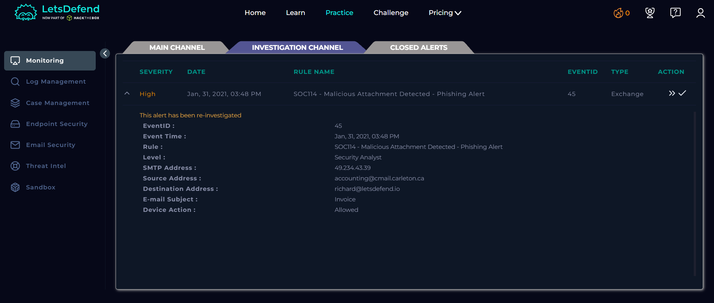
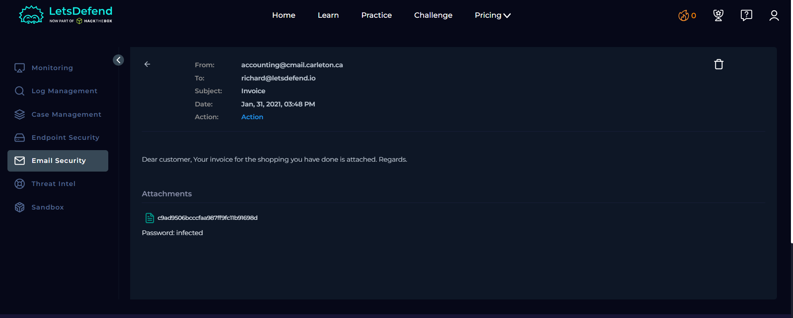
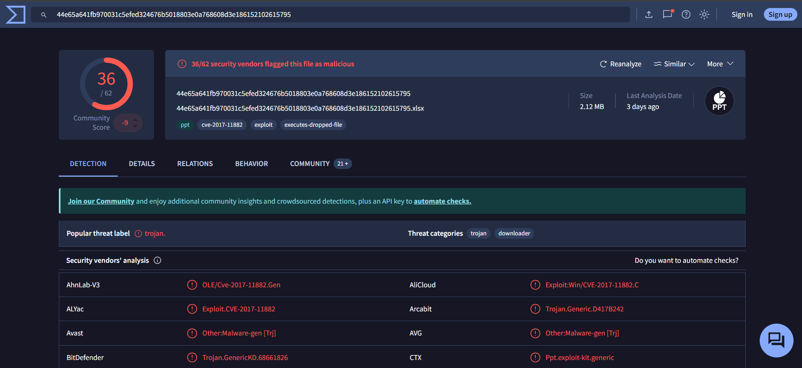
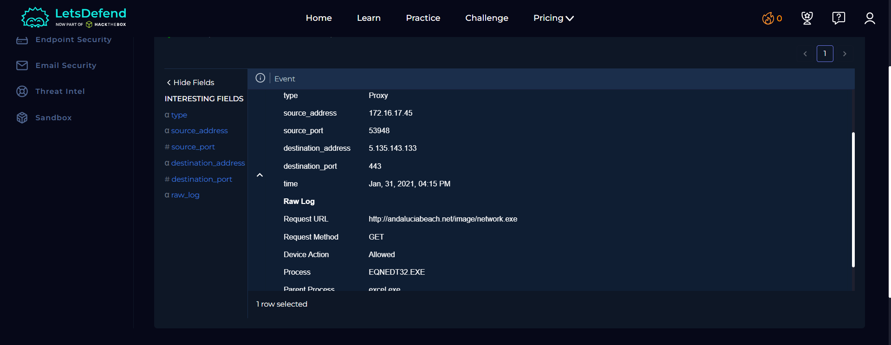
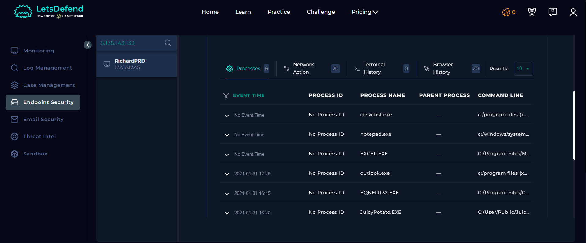
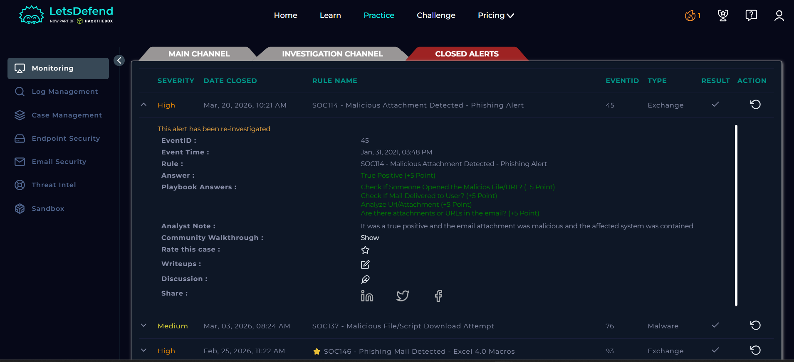

# SOC Alert Investigation Report

**Platform:** LetsDefend\
**Alert Name:** SOC114 - Malicious Attachment Detected - Phishing Alert\
**Analyst Level:** Security Analyst\
**Status:** True Positive

------------------------------------------------------------------------

## Alert Overview

Below is the original alert generated in LetsDefend:

## Alert Details

| Field | Value |
|-------|--------|
| **Event ID** | 45 |
| **Event Time** | Jan 31, 2021 -- 03:48 PM |
| **Rule Name** | SOC114 - Malicious Attachment Detected - Phishing Alert |
| **SMTP Address** | 49.234.43.39 |
| **Source Address** | accounting@cmail.carleton.ca |
| **Destination Address** | richard@letsdefend.io |
| **Email Subject** | Invoice |
| **Device Action** | Allowed |

------------------------------------------------------------------------

# Investigation Process (Playbook)

## 1️⃣ Parse Email

Before starting the analysis, information about the incoming email was obtained.

### Questions & Answers

**When was it sent?**  
Jan 31, 2021 -- 03:48 PM  

**What is the email's SMTP address?**  
49.234.43.39  

**What is the sender address?**  
accounting@cmail.carleton.ca  

**What is the recipient address?**  
richard@letsdefend.io  

**Is the mail content suspicious?**  
The email content appears legitimate and follows a common business format:  
"Dear customer, Your invoice for the shopping you have done is attached. Regards."  

However, it is considered suspicious due to:
- Generic greeting ("Dear customer")
- Unexpected invoice context
- Presence of an attachment
- Sender-recipient relationship not clearly established  

**Are there any attachments?**  
Yes, the email contains a file attachment.  

------------------------------------------------------------------------

## 2️⃣ Attachment/URL Presence Check

The email was reviewed to determine whether it contains any attachments or URLs.

### Findings

- The email contains an attachment.

**Selection:** Yes

------------------------------------------------------------------------

## 3️⃣ Malware Analysis (VirusTotal)

The attachment hash was analyzed using external threat intelligence platforms.

### Findings

- File hash: `c9ad9506bcccfaa987ff9fc11b91698d`
- Flagged as **malicious** by multiple security vendors
- Identified as a malicious file used in phishing campaigns

**Selection:** Malicious

------------------------------------------------------------------------

## 4️⃣ Email Delivery Check

The alert was reviewed to determine whether the email was delivered to the recipient.

### Findings

- Device action is marked as **Allowed**
- This confirms that the email was successfully delivered to the user

**Selection:** Delivered

------------------------------------------------------------------------

## 5️⃣ Remediation - Delete Email

The malicious email was removed from the recipient's mailbox.

### Action Taken

- Email deleted from user mailbox

------------------------------------------------------------------------

## 6️⃣ Check File/URL Execution (Log Management)

Logs were analyzed to determine whether the malicious attachment or related infrastructure was accessed.

### Findings

- Logs show access to one of the identified C2 addresses
- Indicates that the attachment was opened or executed

**Selection:** Opened

------------------------------------------------------------------------

## 7️⃣ Containment (EDR)

The affected endpoint was investigated and contained.

### Findings

- Suspicious process observed on the endpoint
- Endpoint identified via destination address correlation
- Machine successfully contained

**Selection:** Contained

------------------------------------------------------------------------

# Artifacts Collected

- Malicious File Hash:  
  `c9ad9506bcccfaa987ff9fc11b91698d`

------------------------------------------------------------------------

# Analyst Note

The email contained a malicious attachment disguised as an invoice. The file was verified as malicious through VirusTotal analysis. Since the device action was allowed, the email was delivered to the user and the attachment was opened, as confirmed by log evidence showing suspicious activity. The affected endpoint was promptly contained to prevent further compromise.

------------------------------------------------------------------------

# Final Verdict

**Classification:** True Positive\
**Impact:** Successful Execution (Contained)\
**Compromise Status:** Partial compromise detected\
**Action Taken:** Email deleted and endpoint contained

---

## License

This project is licensed under the MIT License. See the [LICENSE](LICENSE) file for details.

---

## ⚠️ Disclaimer

This project is based on a simulated SOC environment provided by LetsDefend.

All scenarios, logs, IP addresses, hostnames, and artifacts are part of a training platform and may or may not represent real organizational infrastructure.

This report is created solely for educational and portfolio purposes.

Screenshots are taken from the LetsDefend training platform and are used here for educational documentation purposes only.
