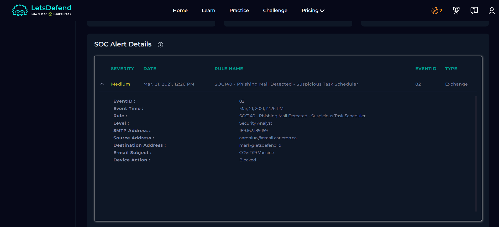
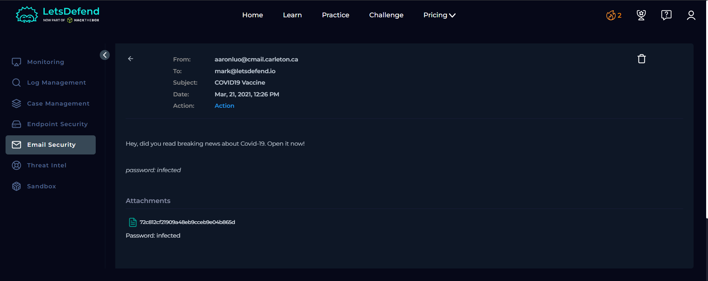
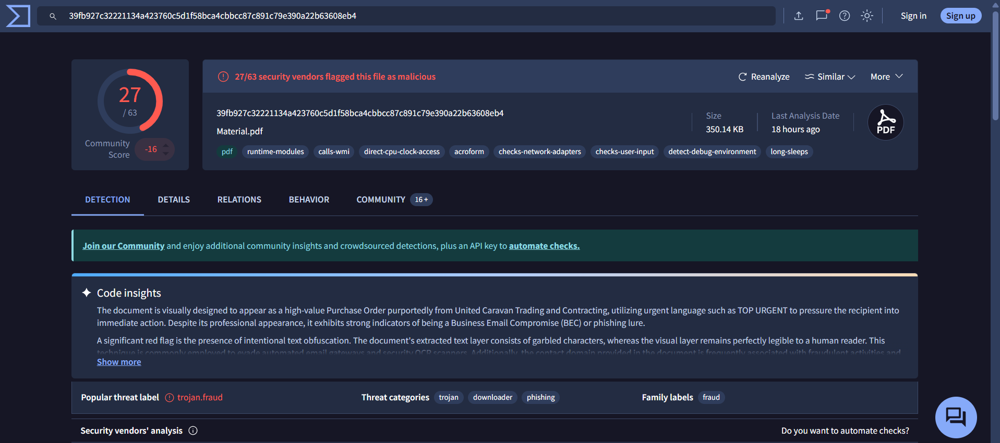
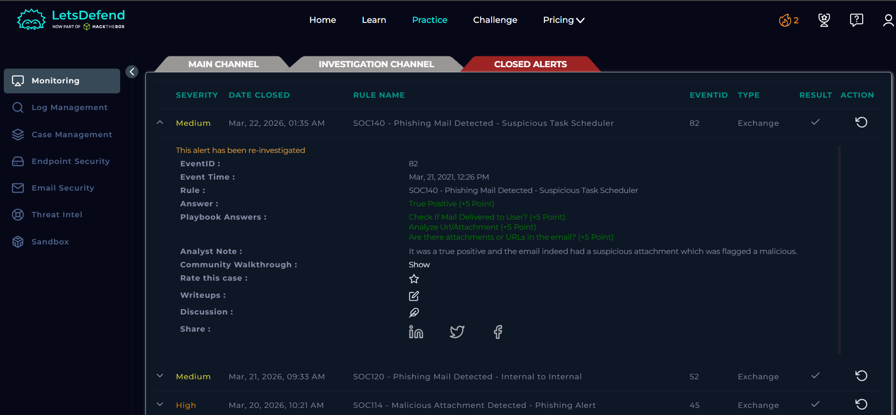

# SOC Alert Investigation Report

**Platform:** LetsDefend\
**Alert Name:** SOC140 - Phishing Mail Detected - Suspicious Task Scheduler\
**Analyst Level:** Security Analyst\
**Status:** True Positive

------------------------------------------------------------------------

## Alert Overview

Below is the original alert generated in LetsDefend:

## Alert Details

| Field | Value |
|-------|--------|
| **Event ID** | 82 |
| **Event Time** | Mar 21, 2021 -- 12:26 PM |
| **Rule Name** | SOC140 - Phishing Mail Detected - Suspicious Task Scheduler |
| **SMTP Address** | 189.162.189.159 |
| **Source Address** | aaronluo@cmail.carleton.ca |
| **Destination Address** | mark@letsdefend.io |
| **Email Subject** | COVID19 Vaccine |
| **Device Action** | Blocked |

------------------------------------------------------------------------

# Investigation Process (Playbook)

## 1️⃣ Parse Email

Before starting the analysis, information about the incoming email was obtained.

### Questions & Answers

**When was it sent?**  
Mar 21, 2021 -- 12:26 PM  

**What is the email's SMTP address?**  
189.162.189.159  

**What is the sender address?**  
aaronluo@cmail.carleton.ca  

**What is the recipient address?**  
mark@letsdefend.io  

**Is the mail content suspicious?**  
The email content was reviewed:

"Hey, did you read breaking news about Covid-19. Open it now!  
password: infected  

Attachments  

72c812cf21909a48eb9cceb9e04b865d  
Password: infected"

The message appears suspicious due to:
- Urgent call to action ("Open it now!")
- Use of trending topic (COVID-19) as a lure
- Password-protected attachment (common malware delivery technique)
- Poor formatting and unusual structure  

**Are there any attachments?**  
Yes, the email contains an attachment.  

**Selection:** Suspicious

------------------------------------------------------------------------

## 2️⃣ Attachment/URL Presence Check

The email was reviewed to determine whether it contains any attachments or URLs.

### Findings

- The email contains an attachment.

**Selection:** Yes

------------------------------------------------------------------------

## 3️⃣ Malware Analysis (VirusTotal)

The attachment hash was analyzed using external threat intelligence platforms.

### Findings

- File hash: `72c812cf21909a48eb9cceb9e04b865d`
- Flagged as **malicious** by multiple vendors
- Likely used for malware delivery via phishing campaigns

**Selection:** Malicious

------------------------------------------------------------------------

## 4️⃣ Email Delivery Check

The alert was reviewed to determine whether the email was delivered to the recipient.

### Findings

- Device action is marked as **Blocked**
- This confirms that the email was not delivered to the user

**Selection:** Not Delivered

------------------------------------------------------------------------

## 5️⃣ Artifact Collection

Relevant artifacts were collected for threat intelligence and future detection.

### Artifacts

- Malicious File Hash:  
  `72c812cf21909a48eb9cceb9e04b865d`

------------------------------------------------------------------------

# Analyst Note

The email was identified as a phishing attempt leveraging COVID-19 themed social engineering. It contained a password-protected attachment, which is a common technique used to evade security controls. The attachment was confirmed malicious via VirusTotal analysis. Since the device action was blocked, the email was not delivered, preventing any potential execution or compromise.

------------------------------------------------------------------------

# Final Verdict

**Classification:** True Positive\
**Impact:** Prevented\
**Compromise Status:** No successful infection\
**Action Taken:** Alert closed after confirmation of prevention

---

## License

This project is licensed under the MIT License. See the [LICENSE](LICENSE) file for details.

---

## ⚠️ Disclaimer

This project is based on a simulated SOC environment provided by LetsDefend.

All scenarios, logs, IP addresses, hostnames, and artifacts are part of a training platform and may or may not represent real organizational infrastructure.

This report is created solely for educational and portfolio purposes.

Screenshots are taken from the LetsDefend training platform and are used here for educational documentation purposes only.
