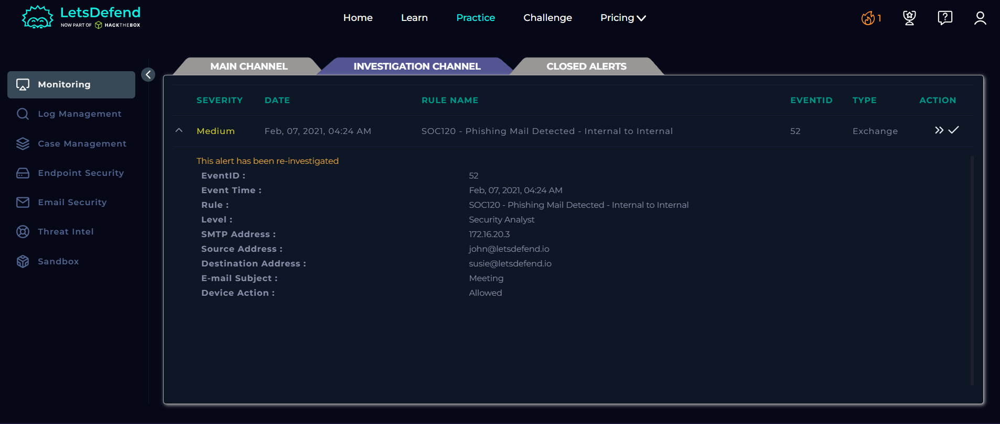
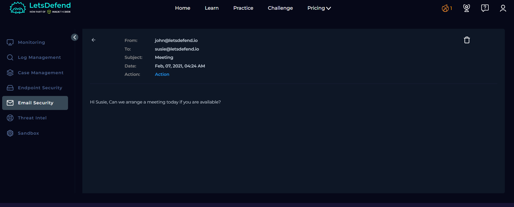
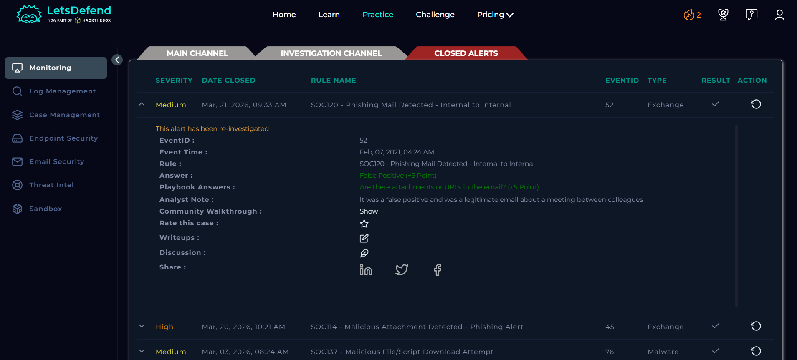

# SOC Alert Investigation Report

**Platform:** LetsDefend\
**Alert Name:** SOC120 - Phishing Mail Detected - Internal to Internal\
**Analyst Level:** Security Analyst\
**Status:** False Positive

------------------------------------------------------------------------

## Alert Overview

Below is the original alert generated in LetsDefend:

## Alert Details

| Field | Value |
|-------|--------|
| **Event ID** | 52 |
| **Event Time** | Feb 07, 2021 -- 04:24 AM |
| **Rule Name** | SOC120 - Phishing Mail Detected - Internal to Internal |
| **SMTP Address** | 172.16.20.3 |
| **Source Address** | john@letsdefend.io |
| **Destination Address** | susie@letsdefend.io |
| **Email Subject** | Meeting |
| **Device Action** | Allowed |

------------------------------------------------------------------------

# Investigation Process (Playbook)

## 1️⃣ Parse Email

Before starting the analysis, information about the incoming email was obtained.

### Questions & Answers

**When was it sent?**  
Feb 07, 2021 -- 04:24 AM  

**What is the email's SMTP address?**  
172.16.20.3  

**What is the sender address?**  
john@letsdefend.io  

**What is the recipient address?**  
susie@letsdefend.io  

**Is the mail content suspicious?**  
The email content was reviewed using email security tools:  
"Hi Susie, Can we arrange a meeting today if you are available?"  

The message appears legitimate and consistent with normal internal communication. There are no signs of phishing such as urgency, malicious links, or social engineering tactics.  

**Are there any attachments?**  
No, the email does not contain any attachments.  

------------------------------------------------------------------------

## 2️⃣ Attachment/URL Presence Check

The email was reviewed to determine whether it contains any attachments or URLs.

### Findings

- No attachments or URLs were found in the email.

**Selection:** No

------------------------------------------------------------------------

## 3️⃣ Artifact Collection

Relevant artifacts were collected for tracking and future reference.

### Artifacts

- Sender Email Address:  
  `john@letsdefend.io`

------------------------------------------------------------------------

# Analyst Note

The email was analyzed and determined to be a legitimate internal communication between employees regarding a meeting. The content was simple, contextually appropriate, and did not contain any phishing indicators such as malicious links, attachments, or social engineering techniques.

------------------------------------------------------------------------

# Final Verdict

**Classification:** False Positive\
**Impact:** No Threat Detected\
**Compromise Status:** No compromise\
**Action Taken:** Alert closed after verification

---

## License

This project is licensed under the MIT License. See the [LICENSE](LICENSE) file for details.

---

## ⚠️ Disclaimer

This project is based on a simulated SOC environment provided by LetsDefend.

All scenarios, logs, IP addresses, hostnames, and artifacts are part of a training platform and may or may not represent real organizational infrastructure.

This report is created solely for educational and portfolio purposes.

Screenshots are taken from the LetsDefend training platform and are used here for educational documentation purposes only.
