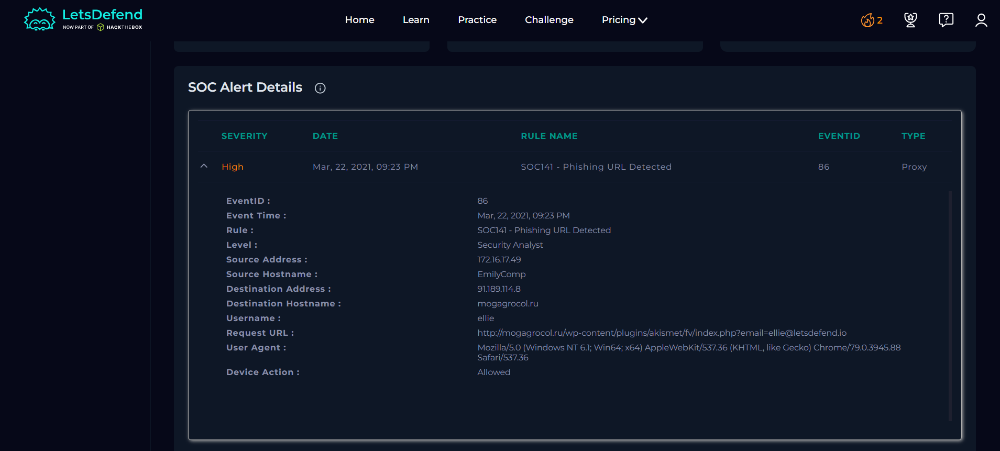
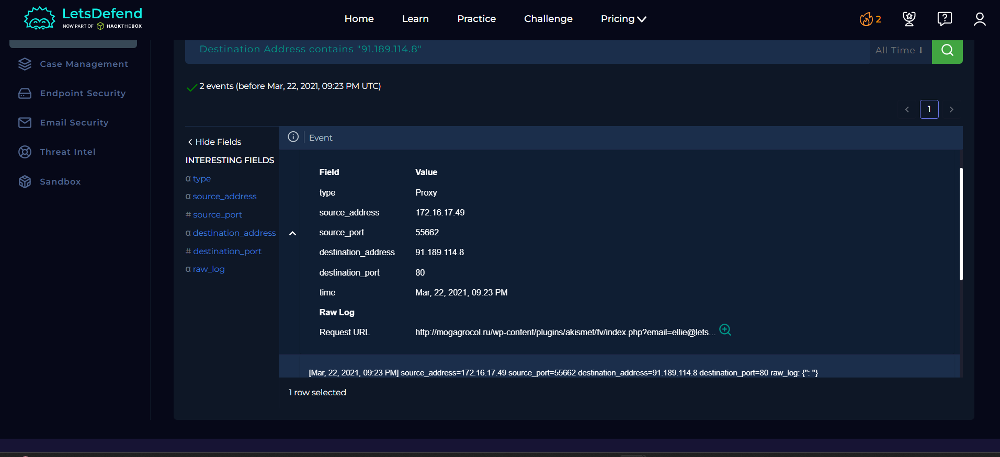
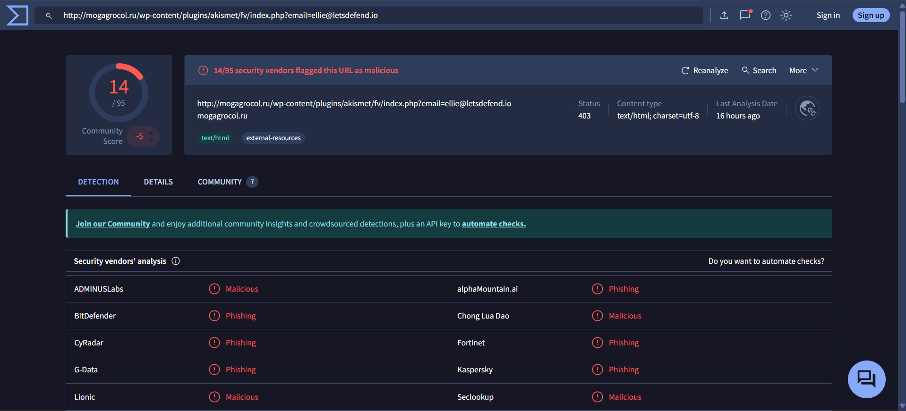
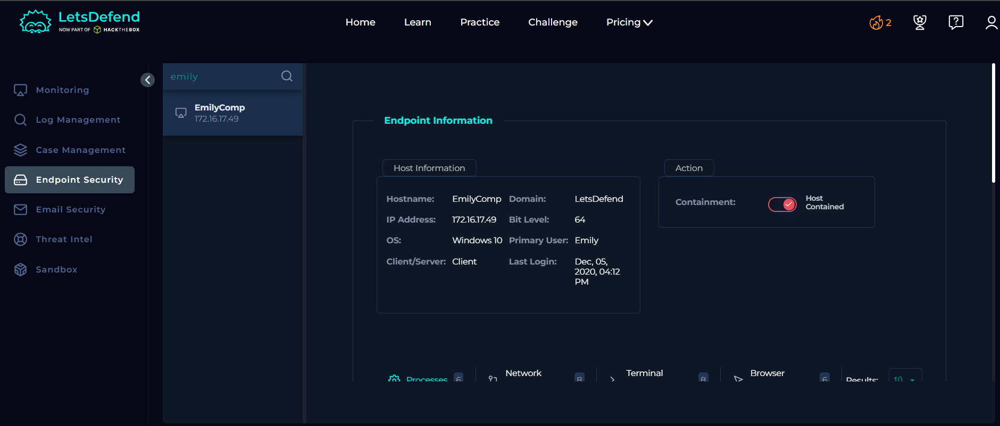
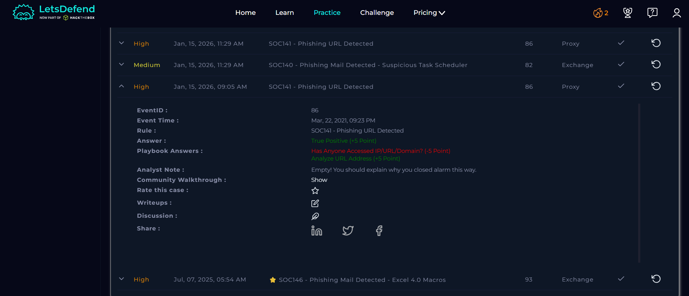

# SOC Alert Investigation Report

**Platform:** LetsDefend\
**Alert Name:** SOC141 - Phishing URL Detected\
**Analyst Level:** Security Analyst\
**Status:** True Positive

------------------------------------------------------------------------

## Alert Overview

Below is the original alert generated in LetsDefend:

## Alert Details

| Field | Value |
|-------|--------|
| **Event ID** | 86 |
| **Event Time** | Mar 22, 2021 -- 09:23 PM |
| **Rule Name** | SOC141 - Phishing URL Detected |
| **Source Address** | 172.16.17.49 |
| **Source Hostname** | EmilyComp |
| **Destination Address** | 91.189.114.8 |
| **Destination Hostname** | mogagrocol.ru |
| **Username** | ellie |
| **Request URL** | http://mogagrocol.ru/wp-content/plugins/akismet/fv/index.php?email=ellie@letsdefend.io |
| **User Agent** | Mozilla/5.0 (Windows NT 6.1; Win64; x64) Chrome/79.0.3945.88 |
| **Device Action** | Allowed |

------------------------------------------------------------------------

# Investigation Process (Playbook)

## 1️⃣ Access Verification

Determined whether the suspicious URL/domain was accessed.

### Findings

- Device action is marked as **Allowed**
- Log entries confirm that the destination URL/IP was accessed by the user

**Selection:** Accessed

------------------------------------------------------------------------

## 2️⃣ URL Analysis

The URL was analyzed using external threat intelligence platforms.

### Findings

- The URL is flagged as **malicious** by multiple vendors
- The domain is associated with phishing activity
- The URL contains an email parameter (`email=ellie@letsdefend.io`), which may indicate potential data exfiltration or tracking

**Selection:** Malicious

------------------------------------------------------------------------

## 3️⃣ Containment (EDR)

The affected endpoint was contained to prevent further compromise.

### Findings

- User activity confirmed interaction with a malicious URL
- Endpoint was successfully contained to mitigate risk

**Selection:** Contained

------------------------------------------------------------------------

## 4️⃣ Artifact Collection

Relevant artifacts were collected for threat intelligence and future detection.

### Artifacts

- Malicious URL:  
  `hxxp://mogagrocol[.]ru/wp-content/plugins/akismet/fv/index[.]php?email=ellie@letsdefend[.]io`

------------------------------------------------------------------------

# Analyst Note

The alert was triggered due to access to a malicious phishing URL. Log analysis confirmed that the user accessed the URL, and threat intelligence sources identified it as malicious. The presence of an email parameter in the URL suggests potential data exposure or tracking behavior. The affected system was promptly contained to prevent further compromise.

------------------------------------------------------------------------

# Final Verdict

**Classification:** True Positive\
**Impact:** User Interaction with Malicious URL\
**Compromise Status:** Potential compromise (contained)\
**Action Taken:** Endpoint contained and artifacts collected

---

## License

This project is licensed under the MIT License. See the [LICENSE](LICENSE) file for details.

---

## ⚠️ Disclaimer

This project is based on a simulated SOC environment provided by LetsDefend.

All scenarios, logs, IP addresses, hostnames, and artifacts are part of a training platform and may or may not represent real organizational infrastructure.

This report is created solely for educational and portfolio purposes.

Screenshots are taken from the LetsDefend training platform and are used here for educational documentation purposes only.
