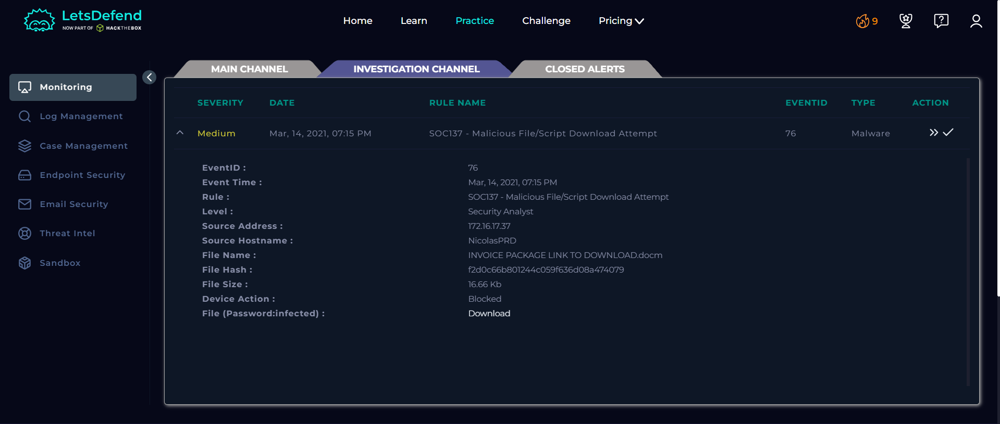
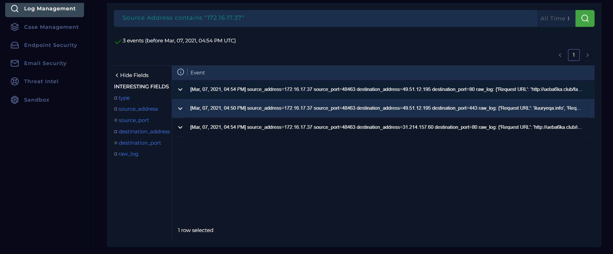
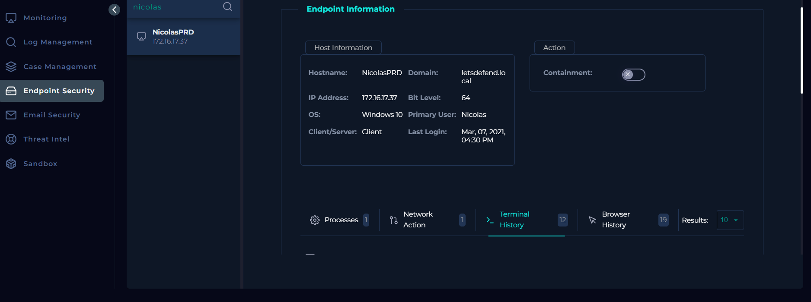
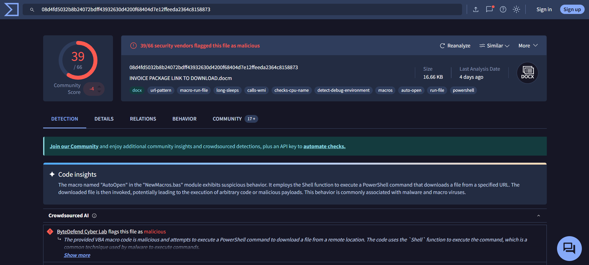
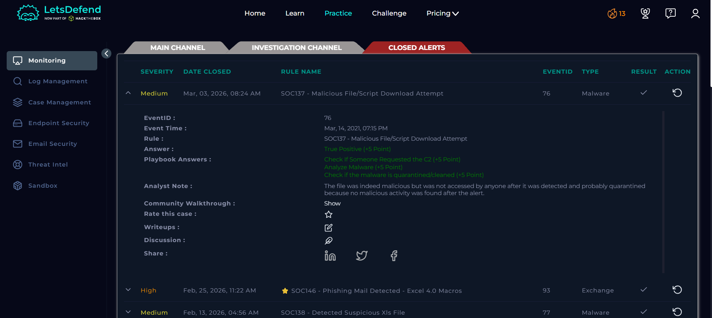

#  SOC Alert Investigation Report

**Platform:** LetsDefend\
**Alert Name:** SOC137 - Malicious File/Script Download Attempt\
**Analyst Level:** Security Analyst\
**Status:** True Positive

------------------------------------------------------------------------

##  Alert Overview

Below is the original alert generated in LetsDefend:

  ##  Alert Details

| Field | Value |
|-------|--------|
| **Event ID** | 76 |
| **Event Time** | March 14, 2021 -- 07:15 PM |
| **Rule Name** | SOC137 - Malicious File/Script Download Attempt |
| **Source Address** | 172.16.17.37 |
| **Source Hostname** | NicolasPRD |
| **File Name** | INVOICE PACKAGE LINK TO DOWNLOAD.docm |
| **File Hash (MD5)** | f2d0c66b801244c059f636d08a474079 |
| **File Size** | 16.66 KB |
| **Device Action** | Blocked |

------------------------------------------------------------------------

#  Investigation Process (Playbook)
 
## 1️⃣ Define Threat Indicator

**Selection:** Other

This alert indicates an attempt to download a malicious `.docm` file
(macro-enabled document).\
Macro-enabled documents are commonly used for initial access and malware
delivery.

------------------------------------------------------------------------

## 2️⃣ Log Management Investigation

Log analysis screenshot:

### Findings

-   No log entries were found on the exact event date.
-   Prior to the event, connections to suspicious URLs were observed:

    http://ueba6ka.club/images/DVeUkINudhi79z0c_2Bv/hcMjSPUhHNICgDZ2eJc/uPkHWXvBmVjikkuyor3cnx/gi3BCr71LrlRP/OOmOS8_2/Bl7A_2Fjz2BM4Pth4RZbBKn/1OVxs19bE9/6wtE2QLgVO1DP1TCF/SoIEOJUXIYbo/RtuJbNDFWW5/V.avi
    http://ueba6ka.club/favicon.ico

-   A suspicious PowerShell process was executed before the alert.
-   No malicious activity was recorded after the alert timestamp.

------------------------------------------------------------------------

## 3️⃣ Endpoint Security Investigation

Endpoint security screenshot:

### Findings

-   Suspicious command-line activity was observed prior to the event.
-   No malicious processes or commands were observed after the alert
    time.
-   Device action shows **Blocked**, indicating prevention at endpoint
    level.

### Conclusion

Since: - The device action was blocked\
- No post-alert malicious activity was detected\
- No C2 communication occurred

The file was likely **quarantined/prevented successfully**.

**Selection:** Quarantined

------------------------------------------------------------------------

## 4️⃣ Malware Analysis (VirusTotal)

VirusTotal analysis screenshot:

### Findings

-   File hash: `f2d0c66b801244c059f636d08a474079`
-   Flagged as **malicious**
-   Identified as a macro-enabled document used for malware delivery
-   C2 addresses identified in threat intelligence data

**Selection:** Malicious

------------------------------------------------------------------------

## 5️⃣ C2 Communication Check

-   Reviewed C2 addresses obtained from VirusTotal.
-   Searched Log Management for connections to those C2 IPs/domains.

### Findings

-   None of the identified C2 addresses were accessed.
-   No outbound communication occurred after the alert.
-   The previously accessed suspicious domain was not listed among the
    file's C2 infrastructure.

**Selection:** Not Accessed

------------------------------------------------------------------------

# 🧠 Artifacts Collected

-   Malicious File Hash:\
    `f2d0c66b801244c059f636d08a474079`

The hash was added to artifacts for threat intelligence enrichment and
future detection.

------------------------------------------------------------------------

# 📝 Analyst Note

The file was confirmed malicious through VirusTotal analysis. However:

-   The download attempt was blocked.
-   No execution occurred.
-   No C2 communication was observed.
-   No post-alert malicious activity was detected.

The endpoint protection successfully prevented compromise.

------------------------------------------------------------------------

# ✅ Final Verdict

**Classification:** True Positive\
**Impact:** Prevented\
**Compromise Status:** No successful infection\
**Action Taken:** Alert closed after confirmation of containment

---

## License

This project is licensed under the MIT License. See the [LICENSE](LICENSE) file for details.
